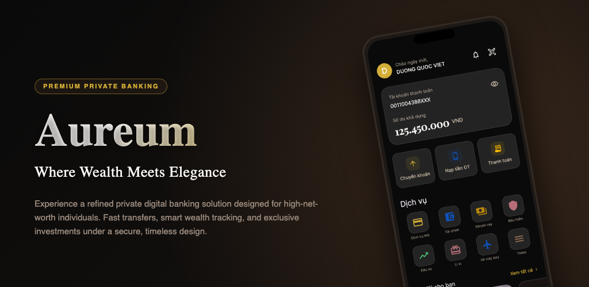
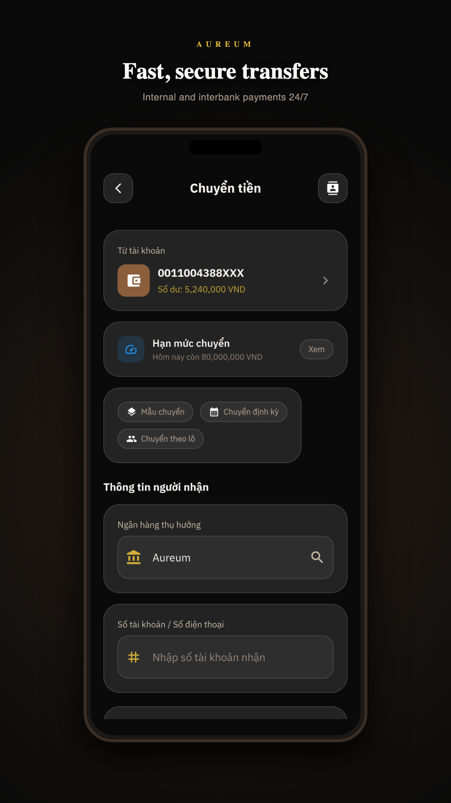
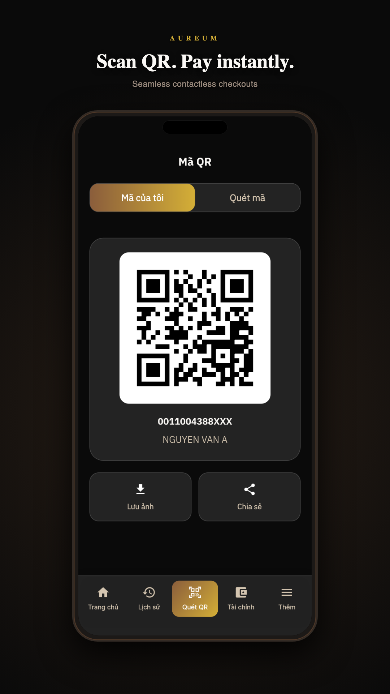
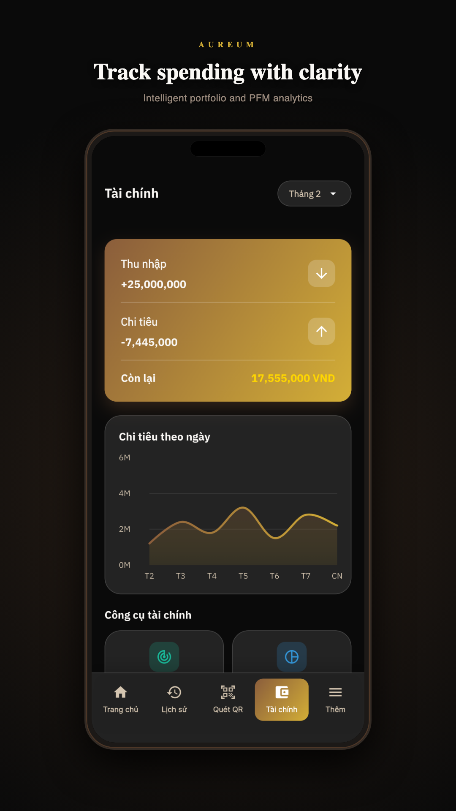
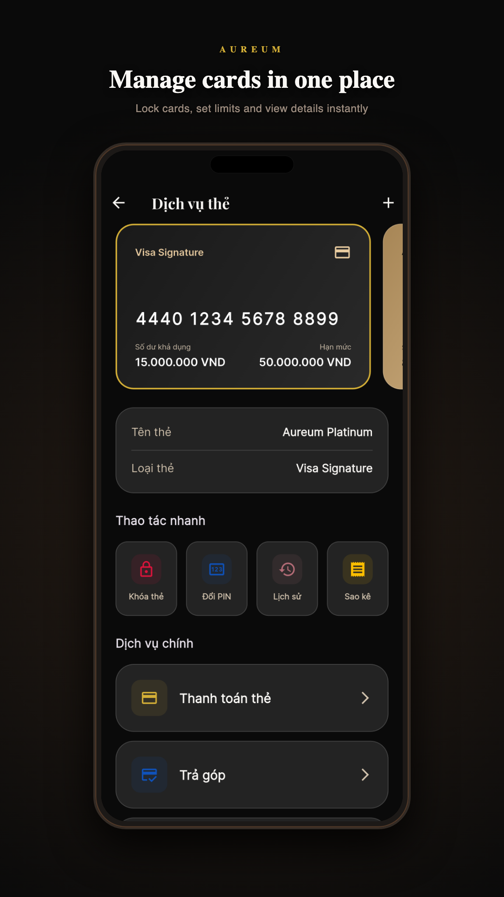
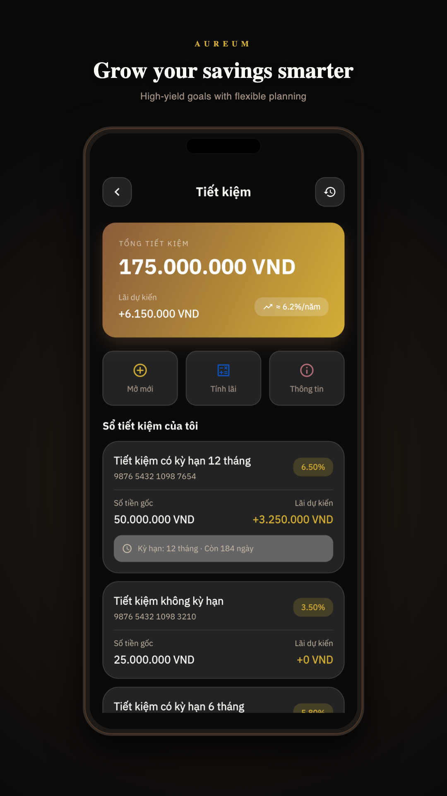
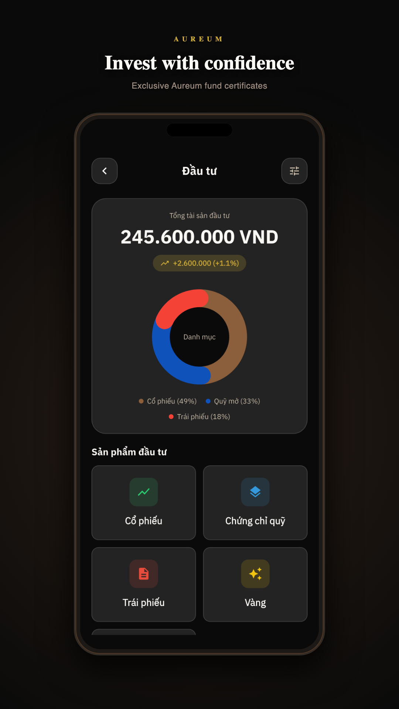
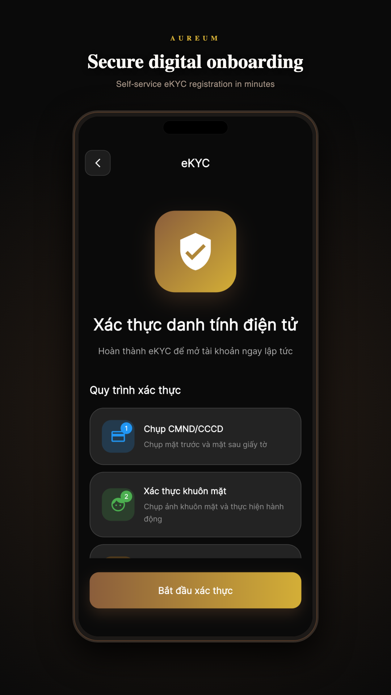

# Aureum — Premium Vietcombank Digibank Clone & Luxury Mobile Banking UI

  

  A high-fidelity luxury mobile banking UI case study and clone of <strong>Vietcombank Digibank (VCB)</strong> built with Flutter. 
  Featuring 277 screens, full glassmorphism dark theme, and complete Vietnamese-first UX flows.

  <a href="#-try-the-app-beta">Try the App Beta</a> ·
  <a href="#-screenshots">Screenshots</a> ·
  <a href="#-feature-overview">Features</a> ·
  <a href="#-disclaimer">Disclaimer</a>

  
  
  
  
  

---

## About

**Aureum** is a production-quality **UI/UX portfolio demo** of a premium digital banking app. It started as a deep study of Vietcombank Digibank design patterns and evolved into an independent luxury brand — **Aureum** (Latin for *golden*).

This is **not** a real bank app. It uses **mock data only** and does **not** connect to banking APIs. The goal is to explore what modern private banking can feel like when design and engineering are built together.

<table>
  <tr>
    <td><b>Concept</b></td>
    <td>Vietcombank Digibank Clone / UI Study</td>
  </tr>
  <tr>
    <td><b>Screens</b></td>
    <td>277 across 38 feature systems</td>
  </tr>
  <tr>
    <td><b>Design Style</b></td>
    <td>Dark glassmorphism, bronze & gold luxury palette</td>
  </tr>
  <tr>
    <td><b>Languages</b></td>
    <td>Vietnamese (default) + English (complete localization)</td>
  </tr>
  <tr>
    <td><b>Architecture</b></td>
    <td>Clean Architecture, BLoC, go_router, get_it</td>
  </tr>
</table>

---

## 📲 Try the App (Beta)

Experience the luxury UI firsthand by installing the beta app on your device. Since this is a pure UI/UX mockup, it is **100% safe** — it requests no sensitive permissions, handles no real funds, and requires no registration.

> [!IMPORTANT]
> **Android Beta Installation Steps:**
>
> 1. **Join the Testers Group:** Join our [Google Group](https://groups.google.com/g/aureum-digibank-testers) to authorize your Google Play Account for the testing track.
> 2. **Opt-in & Download:** Click the [Google Play Testing Link](https://play.google.com/store/apps/details?id=com.dinhsoft.aureum) to accept the testing invite and download the app directly from the Google Play Store.

### Download

| Platform    | Link / Instructions                                                   | Status            |
| ----------- | --------------------------------------------------------------------- | ----------------- |
| **Android** | Follow the [Steps Above](#-try-the-app-beta) to get it on Google Play | **Active (Live)** |
| **iOS**     | [TestFlight](https://testflight.apple.com/join/YOUR_CODE)             | Coming soon       |

### 🚀 Quick Start (After Install)

1. **Install** the app from Google Play (testing track) or TestFlight.
2. **Open** Aureum — you will land on the login screen.
3. **Sign in** with any non-empty password (demo mock auth).
   - Example: `123456`
   - Or tap the **biometric** button to simulate fingerprint / Face ID login.
4. **Explore** via the 5-tab bottom navigation:
   - **Trang chủ** (Home) · **Lịch sử** (History) · **Quét QR** (QR) · **Tài chính** (Finance) · **Thêm** (More)
5. **Try key flows** — transfers, bill pay, cards, savings, invest, eKYC, settings, and more (all mock).
6. **Switch language** — Settings → Language → English / Vietnamese.
7. **Share feedback** — [Open an issue](https://github.com/DucQA/vietcombank_digibank/issues/new) with screenshots and steps.

### 🔍 What to Explore & Test

We encourage you to explore the depth of this case study:

- 📱 **Smooth Navigation:** Test the complex back-stack behavior and deep navigation flows across 107 screens.
- 🎨 **Premium Aesthetics:** Inspect the custom dark glassmorphism theme, gold/bronze design tokens, readability, and touch targets.
- 💸 **Interactive Mock Flows:** Try making a mock transfer, paying bills, opening savings accounts, or applying for mock loans.
- 🇻🇳 **Dual Language Localization:** Switch between Vietnamese (default) and English seamlessly in Settings.
- 🛡️ **Interactive eKYC:** Experience the custom mock eKYC flow including simulated OCR card scanning, FacePay, and document verification.

### 🔒 Privacy & Safety Guarantee

- **Zero Permissions:** The app does not request access to your contacts, camera (except for mock eKYC preview), location, or files.
- **No Real Assets:** No real money or accounts are connected. All balances and transactions are generated locally.

---

## 📸 Screenshots

  
  
  
  

  
  
  

---

## ✨ Feature Overview

All features below are high-fidelity, fully navigable **UI mockups with simulated data** — no real financial APIs or credentials are used.

### 1. 🧭 Core Structure & Navigation (3 Screens)
*   **Home & Dashboard** (1 screen): Balance details, multi-account view, customized quick actions, services grid, and promotions feed.
*   **Main Navigation** (1 screen): Primary bottom-bar shell controller (`MainScreen`) mapping central tabs.
*   **More Menu** (1 screen): Categorized index of all available digital banking features.

### 2. 🔐 Authentication & Onboarding (18 Screens)
*   **eKYC Onboarding** (11 screens): ID card OCR scanning, camera liveness detection, error/success screens, NFC identity scanning, and biometric registration.
*   **Authentication** (4 screens): Passcode login, biometric prompt simulation (Face ID / fingerprint), and forgot password verification/reset.
*   **VNeID Integration** (3 screens): National digital ID linking flow.

### 3. 💳 Accounts & Wallet Management (16 Screens)
*   **Accounts Directory** (7 screens): Multi-account balances, account nicknames (alias setup), alias search, and special/golden account number registration.
*   **Account Management** (3 screens): Account statement export forms, closure requests, and daily limit updates.
*   **Family Accounts** (3 screens): VCB Family joint savings and spending wallet setups.
*   **eWallet Linking** (3 screens): Third-party wallet integration flow (Momo, ZaloPay).

### 4. 💸 Transfers & Transactions (34 Screens)
*   **Transfer Flow** (15 screens): 24/7 fast & normal transfers to accounts/cards, beneficiary management (add, search, list), scheduled/recurring transfers, cash transfer codes, and batch transfers.
*   **QR Payments & Scanning** (13 screens): QR camera scanner, My QR generator, QR ATM cardless withdrawals, custom QR bill sharing, and VietQR generation.
*   **Transaction Receipts** (6 screens): Main transaction history page, details page, receipt detail screen, and success states.

### 5. 💳 Cards & Card Services (25 Screens)
*   **Cards Center** (25 screens): Credit/debit card carousel, activation, instant card locking, transaction limits configuration, PIN resets, physical card print delivery orders, replacement orders, repayments, transaction installment converter, and card gamification/quizzes.

### 6. 🔌 Payments, Top-ups & Public Services (32 Screens)
*   **Bill Payments** (12 screens): Electric, water, internet, television, tuition, insurance, and hospital fees with recurring autopay configuration.
*   **Mobile Top-ups** (6 screens): Mobile balance top-up forms, prepaid scratchcard purchasing, and telecom mobile data package plans.
*   **Government Payments** (11 screens): State budget taxes, seaport fees, social insurance contributions, and traffic fine lookups.
*   **Lucky Money (Lì xì)** (3 screens): Personalized envelope skins and greeting message forms.

### 7. 📈 Savings & Loans (25 Screens)
*   **Savings (Tiết kiệm)** (16 screens): Open savings accounts, Accumulative deposits, An Vui savings, interest rate tables, projection graphs, top-up/withdrawals, payout settings, and maturity settlements.
*   **Loans & Overdrafts** (9 screens): Overdraft application forms, loan disbursements, document uploads, application status trackers, repayment schedules, and principal payments.

### 8. 📊 Investments & Wealth (25 Screens)
*   **Investments** (9 screens): Stock trading top-up interfaces, VCBS account registration, mutual funds, and certificate deposits.
*   **Insurance** (8 screens): Insurance products hub, package comparison, calculation tools, policy proposals, and claims overview.
*   **Merchant Services** (2 screens): Revenue overview dashboards and KiotViet integration.
*   **Digital Signatures & Documents** (5 screens): E-contracts locker, digital signature registration canvases, and e-statement agreements.
*   **Finance Tab** (1 screen): Comprehensive assets and liabilities overview.

### 9. 📈 PFM (Personal Finance Management) (8 Screens)
*   **PFM Dashboard** (8 screens): Expense trackers, monthly budget planners, financial goal progress logs, and visual spending report graphs.

### 10. 🚀 More Services (Extended Hub) (24 Screens)
*   **Extended Services** (24 screens): Gold Trading & SJC Gold Booking, ePass/VETC toll top-ups, e-commerce shopping, Vietlott ticket orders, charity donations, airport lounge passes, forex exchange tables, and an interactive Year-in-Review (Lookback 2025).

### 11. ✈️ Lifestyle Utilities (Travel & Bookings) (38 Screens)
*   **Utilities Hub** (38 screens):
    *   **Flight Booking**: Search engines, results filter, passenger information forms, seat maps, and checkout.
    *   **Train & Bus Tickets**: Seat selectors, ticket booking, and receipts.
    *   **Hotel Booking**: Search engines, room filters, guest info, and invoice details.
    *   **Taxi Hailing**: Map route preview, taxi booking, and rides.
    *   **Movie Tickets**: Cinema choice, seat mapping, and ticket receipts.
    *   **VNA Check-in**: Flight check-in and boarding passes.

### 12. ⚙️ Settings, Profile & Security (9 Screens)
*   **Settings Menu** (4 screens): User profiles, security setting dashboards, and notifications options.
*   **Security Settings** (4 screens): Login passcode changes, default account preferences, favorite features selectors, and app theme selectors.
*   **Biometrics Setup** (1 screen): Secure device biometric setups.

### 13. 💬 Customer Support & Engagement (20 Screens)
*   **Support Hub** (9 screens): Live chat support, FAQ indices, branch booking tickets, and branch/ATM locator maps.
*   **Rewards & Loyalty** (5 screens): Loyalty points history, catalog, and UrBox coupon list/details.
*   **Promotions** (2 screens): Active promotion lists and campaign details.
*   **Notifications Inbox** (4 screens): Notifications inbox and filtering.

---

## 📊 Project scale

| Metric           | Value                   |
| ---------------- | ----------------------- |
| Screens          | **277**           |
| Feature systems  | **38**                  |
| State management | flutter_bloc            |
| Routing          | go_router + auth guards |
| DI               | get_it                  |
| Networking       | Dio (mock fallback)     |

---

## 🎨 Design

| Element | Detail |
|---------|--------|
| **Brand** | Aureum — premium private banking |
| **Palette** | Bronze `#8B5E3C`, Gold `#D4AF37`, Dark `#0A0A0A` |
| **Typography** | Playfair Display + Inter |
| **Style** | Glassmorphism, dark luxury theme |
| **Inspiration** | Premium digital banking UX (Vietcombank Digibank design study) |

---

## ⚠️ Disclaimer

> **Aureum is a UI/UX demonstration project.** It is not affiliated with Vietcombank or any financial institution. It does not provide real banking services, store real credentials, or process real transactions. Do not enter real personal or financial data. For educational and design portfolio purposes only.
