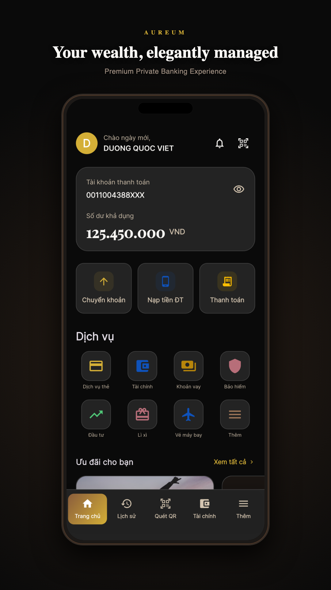

# Aureum — Premium Mobile Banking UI

<p align="center">
  
</p>

<p align="center">
  <strong>Where Wealth Meets Elegance</strong><br/>
  A luxury mobile banking UI demo built with Flutter — 107 screens, glassmorphism design, Vietnamese-first flows.
</p>

<p align="center">
  <a href="#-try-the-app-beta">Try the App</a> ·
  <a href="#-screenshots">Screenshots</a> ·
  <a href="#-feature-overview">Features</a> ·
  <a href="#-for-developers">Developers</a> ·
  <a href="#-disclaimer">Disclaimer</a>
</p>

<p align="center">
  
  
  
  
</p>

---

## About

**Aureum** is a production-quality **UI/UX portfolio demo** of a premium digital banking app. It started as a deep study of Vietcombank Digibank design patterns and evolved into an independent luxury brand — **Aureum** (Latin for *golden*).

This is **not** a real bank app. It uses **mock data only** and does **not** connect to banking APIs. The goal is to explore what modern private banking can feel like when design and engineering are built together.

| | |
|---|---|
| **Screens** | 107 across 24 feature systems |
| **Design** | Dark glassmorphism, bronze & gold palette |
| **Languages** | Vietnamese (default) + English |
| **Architecture** | Clean Architecture, BLoC, go_router |
| **Captured on** | Google Pixel 6 Pro (real device screenshots) |

---

## 📲 Try the App (Beta)

We welcome testers to explore the UI/UX and share feedback. No real money, accounts, or transactions are involved.

### Download

| Platform | Link | Status |
|----------|------|--------|
| **Android** | [Google Play (Internal / Open Testing)](https://play.google.com/store/apps/details?id=YOUR_APP_ID) | Replace with your link |
| **iOS** | [TestFlight](https://testflight.apple.com/join/YOUR_CODE) | Replace with your link |

> **Maintainers:** Update the links above before publishing the repo. See [PLAY_STORE_DEPLOYMENT_GUIDE.md](PLAY_STORE_DEPLOYMENT_GUIDE.md) for deployment steps.

### Quick start (after install)

1. **Install** the app from Google Play (testing track) or TestFlight.
2. **Open** Aureum — you will land on the login screen.
3. **Sign in** with any non-empty password (demo mock auth).
   - Example: `demo123`
   - Or tap the **biometric** button to simulate fingerprint / Face ID login.
4. **Explore** via the 5-tab bottom navigation:
   - **Trang chủ** (Home) · **Lịch sử** (History) · **Quét QR** (QR) · **Tài chính** (Finance) · **Thêm** (More)
5. **Try key flows** — transfers, bill pay, cards, savings, invest, eKYC, settings, and more (all mock).
6. **Switch language** — Settings → Language → English / Vietnamese.
7. **Share feedback** — [Open an issue](https://github.com/YOUR_USERNAME/YOUR_REPO/issues/new) with screenshots and steps.

### What to test

- Navigation depth and back-stack behavior
- Readability, spacing, and touch targets
- Glassmorphism / dark theme consistency
- Form flows (transfer, bills, cards, savings)
- Vietnamese vs English localization
- Overall premium banking *feel*

### What you cannot do

- Real payments, transfers, or account opening
- Connect to real bank accounts
- Expect live API data (all responses are mocked)

---

## 📸 Screenshots

<p align="center">
  
  
  
  
</p>

<p align="center">
  
  
  
</p>

<details>
<summary><strong>Raw device screenshots (Pixel 6 Pro)</strong></summary>

| Screen | Preview |
|--------|---------|
| Login |  |
| Home |  |
| History |  |
| QR |  |
| Finance |  |
| Transfer |  |
| Cards |  |
| Bills |  |
| Savings |  |
| Invest |  |
| eKYC |  |

</details>

---

## ✨ Feature Overview

All features below are **UI mockups with simulated data** — fully navigable, not connected to real services.

### Core navigation

| Tab | Description |
|-----|-------------|
| **Home** | Account overview, balance card, quick actions, services grid, promotions |
| **History** | Transaction history with filters |
| **QR** | My QR, scan-to-pay, QR history |
| **Finance** | Personal finance / spending insights (charts) |
| **More** | Extended services, settings entry points |

### Authentication & onboarding

- Login with password (mock)
- Biometric login (fingerprint / Face ID UI)
- eKYC flow — OCR, liveness, NFC, FacePay screens
- VNeID digital ID linking (mock)
- Session & device management

### Money & accounts

- **Transfers** — input, confirm, OTP, success, beneficiaries, templates, scheduled & batch transfers, limits
- **Accounts** — multi-account view, aliases, statements, limits, closure flow
- **Savings** — open account, top-up, withdraw, projection, payout options, settlement
- **Loans** — overview, detail, payment, schedule, documents
- **PFM** — budget planner, expense tracker, financial goals

### Cards

- Card carousel & details
- Card services hub
- Lock / unlock, PIN change, limits
- Statements, transactions, installments
- Virtual card, activation, replacement, repayment

### Payments & top-up

- **QR payments** — scan, pay, result, My QR, ATM cardless, lucky money QR
- **Bill payment** — electricity, water, internet, TV, tuition, traffic, hospital, insurance + autopay
- **Mobile top-up** — prepaid recharge flow
- **eWallets** — Momo, ZaloPay linking (mock)

### Investments & insurance

- Investment portfolio & products
- Stock top-up, certificates
- Insurance products & policy management

### QR & lifestyle utilities

- Flights, taxi, hotel, movies booking (UI)
- SJC gold booking, toll top-up (ePass / VETC)
- Forex, charity, shopping, lounge access
- Lucky money (Lì xì) themes & forms

### Support & engagement

- Live chat, FAQ, branch / ATM map
- Branch booking & rates info
- Promotions, vouchers, loyalty points, rewards catalog
- Notifications center
- Document center & e-statements

### Settings & security

- Profile, security, notifications
- Biometric settings, 2FA, transaction PIN
- Trusted devices, session history
- Language (VI / EN), accessibility, auto-lock
- About, terms & privacy

---

## 📊 Project scale

| Metric | Value |
|--------|-------|
| Screens | **107 / 107** |
| Feature systems | **24** |
| Lines of code | ~35,000+ |
| State management | flutter_bloc |
| Routing | go_router + auth guards |
| DI | get_it |
| Networking | Dio (mock fallback) |

<details>
<summary><strong>All 24 feature systems</strong></summary>

1. Core Structure · 2. eKYC · 3. Investment · 4. Settings & Profile · 5. Notifications
6. Transaction History · 7. Insurance · 8. More Services · 9. Utilities · 10. Promotions
11. Customer Support · 12. Account Management · 13. Financial Tools · 14. Rewards & Loyalty
15. Documents · 16. Advanced Settings · 17. QR Payment · 18. Transfer · 19. Cards
20. Bill Payment · 21. Savings · 22. Loans · 23. Authentication · 24. Home & Navigation

</details>

---

## 🎨 Design

| Element | Detail |
|---------|--------|
| **Brand** | Aureum — premium private banking |
| **Palette** | Bronze `#8B5E3C`, Gold `#D4AF37`, Dark `#0A0A0A` |
| **Typography** | Playfair Display + Inter |
| **Style** | Glassmorphism, dark luxury theme |
| **Inspiration** | Premium digital banking UX (Vietcombank Digibank design study) |

---

## 🛠 For developers

### Prerequisites

- Flutter SDK **3.0+**
- Xcode (iOS) or Android Studio (Android)

### Run locally

```bash
git clone https://github.com/YOUR_USERNAME/YOUR_REPO.git
cd YOUR_REPO
flutter pub get
flutter run
```

### Capture screenshots (integration test)

```bash
flutter drive \
  --driver=test_driver/integration_test.dart \
  --target=integration_test/screenshot_test.dart \
  -d <device_id>
```

Screenshots save to `marketing/raw/`.

### Project structure

```
lib/
├── core/           # Theme, DI, navigation, design system
├── features/       # Feature modules (domain / data / presentation)
├── l10n/           # Vietnamese + English localizations
└── navigation/     # Main shell + bottom nav
```

### Tech stack

`flutter_bloc` · `go_router` · `get_it` · `dio` · `equatable` · `fl_chart` · `mobile_scanner` · `google_fonts`

---

## 🤝 Feedback

Beta testers — thank you! Please report:

- Confusing navigation or dead ends
- Text overflow / layout issues
- Screens that feel unfinished
- Suggestions for animations or accessibility

**[Submit feedback (GitHub Issues)](https://github.com/YOUR_USERNAME/YOUR_REPO/issues/new)**

---

## ⚠️ Disclaimer

> **Aureum is a UI/UX demonstration project.** It is not affiliated with Vietcombank or any financial institution. It does not provide real banking services, store real credentials, or process real transactions. Do not enter real personal or financial data. For educational and design portfolio purposes only.

---

## 📄 License

Private / portfolio project. See repository license terms before redistribution.

---

<p align="center">
  Built with Flutter · Designed for premium banking UX · Open for beta feedback
</p>
